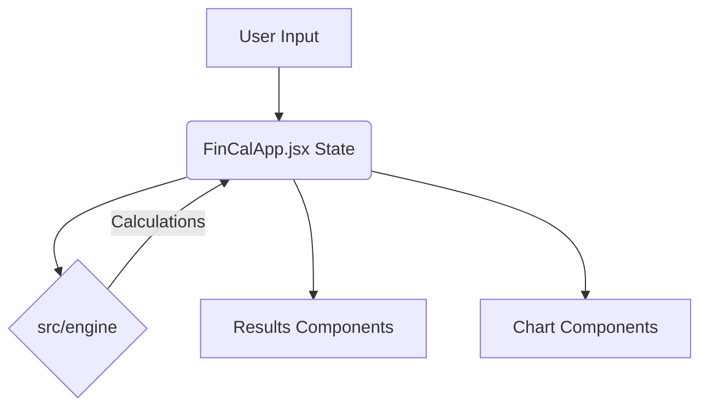
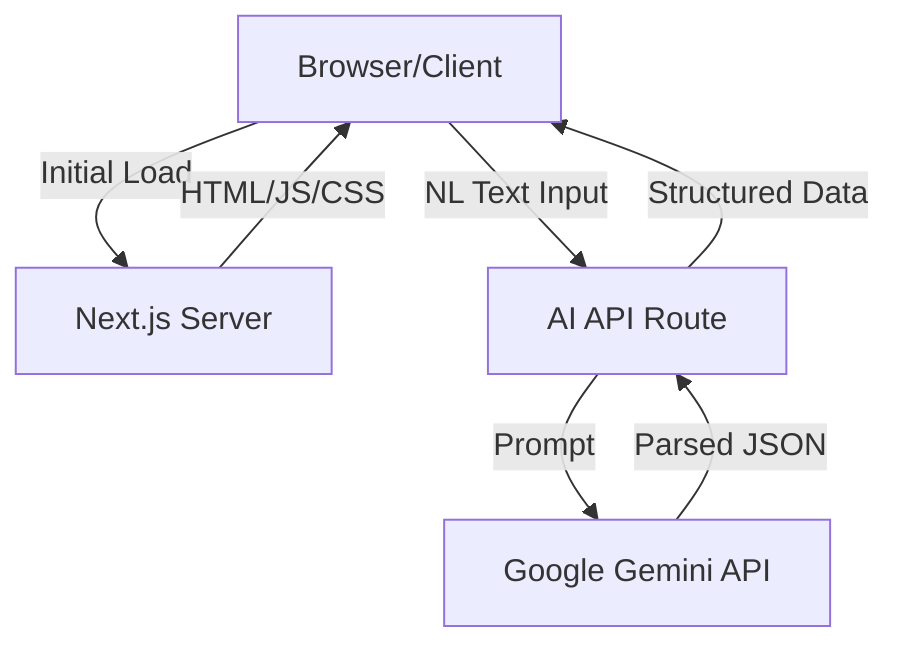
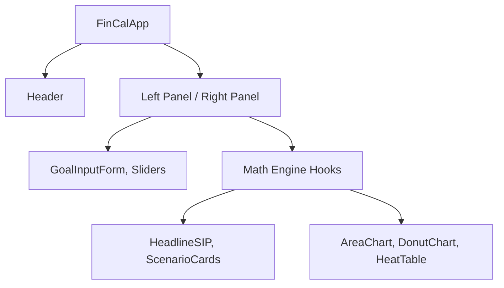

# Architecture Document: FinCal

## 1. Project Overview

- **What problem does this project solve?** FinCal simplifies goal-based financial planning. It helps users calculate the required Systematic Investment Plan (SIP) for specific life goals (house, education, etc.) factoring in inflation, time horizons, and expected returns. It replaces complex spreadsheets with an intuitive, interactive UI.
- **Who is the target audience?** Retail investors, financial planners, and anyone looking to plan their financial future without needing deep financial expertise.
- **High-level goals:** Provide an easy-to-use, visually appealing, and smart calculator that offers scenario analysis, AI-assisted input, and actionable financial insights.
- **Current implementation status:** The project is a fully functional front-end application with comprehensive calculation features, charting, and PDF export capabilities.
- **Technologies used:**
  - **Framework:** Next.js (App Router), React 19
  - **Styling:** Tailwind CSS, Framer Motion (animations), Radix UI (accessible primitives), Magic UI
  - **Data Visualization:** Recharts
  - **Utilities:** jsPDF & html2canvas (PDF generation), @google/generative-ai (AI parsing)
- **Overall architecture style:** Client-heavy Single Page Application (SPA) style architecture served via Next.js. Business logic is separated into an `engine` module, while state is centrally managed at the application root component level.

---

## 2. Folder Structure

The project follows a standard Next.js App Router structure with customized source organization.

- **`src/`**: Root source folder containing all application code.
  - **`app/`**: Next.js App Router directory.
    - *Purpose:* Defines routes, layouts, and API endpoints.
    - *Responsibilities:* Server-side routing, initial page rendering, and backend API routes (like AI parsing).
  - **`components/`**: Reusable React components, further subdivided by domain:
    - **`ai/`**: AI-related UI (Natural Language input, Insights, Validators).
    - **`charts/`**: Data visualization components (AreaChart, DonutChart, GlidePath, HeatTable).
    - **`inputs/`**: User input controls (Sliders, Toggles, Selectors).
    - **`layout/`**: Structural components (Header, HeroSection, Banners).
    - **`results/`**: Components displaying calculated outputs (Headline SIP, Scenario Cards).
    - **`ui/` & `magicui/`**: Generic, reusable UI primitives (Buttons, Cards).
  - **`engine/`**: Core financial calculation logic.
    - *Purpose:* Isolate pure business logic from UI components.
    - *Files:* `formulas.js`, `scenarios.js`, `sensitivity.js`, `stepUp.js`, `validators.js`.
    - *Dependencies:* Pure JavaScript/Math, no React dependencies.
  - **`lib/`**: General utilities and constants.
    - *Purpose:* Shared helper functions and configuration variables (`constants.js`, `utils.js`).

---

## 3. Architecture

- **Architectural Pattern:** Component-Based Architecture with a "Smart Container / Dumb Components" pattern. `FinCalApp.jsx` acts as the primary Smart Container (Controller), while most files in `src/components` are Dumb Components (View).
- **Separation of Concerns:** Strictly enforced between UI (React Components) and Business Logic (`src/engine`). 
- **Dependency Flow:** UI Components -> FinCalApp (State) -> Engine (Math). The UI triggers state changes, which trigger recalculations in the engine, which then flow back down to the UI.
- **Data Flow:** Unidirectional data flow. User inputs are captured in `FinCalApp.jsx` state, processed by `useMemo` hooks calling `engine` functions, and the resulting data (SIP, Future Value, Scenarios) is passed as props to child components.
- **Rendering Strategy:** Primarily Client-Side Rendering (CSR) for the calculator (`'use client'` directive heavily used), with Server-Side Rendering (SSR) for initial landing pages (`page.js`).
- **State Management:** React Local State (`useState`, `useMemo`) at the top level of the calculator (`FinCalApp.jsx`).
- **Business Logic Location:** Isolated entirely within `src/engine/`.
- **Reusable Modules:** The UI components are highly modularized into specific folders based on their role (e.g., `src/components/inputs`).

---

## 4. Features

- **Goal-Based SIP Calculator:** 
  - *Location:* `FinCalApp.jsx` (activeTab: 'calculator')
  - *Business Logic:* `engine/formulas.js`
  - *Flow:* User selects goal -> enters cost/years -> adjusts inflation/return -> views required SIP.
- **AI Goal Parser:**
  - *Location:* `components/ai/NLGoalInput.jsx`
  - *APIs Used:* `@google/generative-ai` via `src/app/api/ai`
  - *Flow:* User types natural language -> API parses intent -> auto-fills form state.
- **3 Scenario Analysis:**
  - *Location:* `components/results/ScenarioCards.jsx`, `engine/scenarios.js`
  - *Business Logic:* Calculates SIP for Conservative (8%), Moderate (10%), Aggressive (12%) returns.
- **Sensitivity Heatmap:**
  - *Location:* `components/charts/SensitivityHeatTable.jsx`, `engine/sensitivity.js`
  - *Business Logic:* Generates a matrix of SIP values varying inflation and returns.
- **Cost of Delay:**
  - *Location:* `components/results/CostOfDelayCard.jsx`
  - *Business Logic:* Calculates the difference in required SIP if the user delays investing by 1, 3, or 5 years.
- **Step-Up SIP & Lumpsum:**
  - *Location:* `components/inputs/StepUpToggle.jsx`, `engine/stepUp.js`, `engine/lumpsum.js`
  - *Business Logic:* Adjusts calculations for annual contribution increases or initial lump sum investments.
- **PDF Export:**
  - *Location:* `components/shared/ExportPdfButton.jsx`
  - *APIs Used:* `html2canvas`, `jspdf`

---

## 5. Routing

- **`/` (Home):**
  - *Purpose:* Landing page explaining the tool's value proposition.
  - *Components:* `page.js`, `FeatureSteps`, `AnimatedShinyText`, `HoverEffect`.
- **`/calculator` (Implicit):**
  - *Purpose:* The main calculator interface. It appears the main app is embedded or navigated to from the landing page. `FinCalApp.jsx` serves as the primary view for the core tool.
- **API Routes:**
  - `/api/ai`: Handles requests to the Google Gemini model for natural language parsing. No authentication required (public utility).

---

## 6. Component Architecture

- **`FinCalApp.jsx`:** The God Component.
  - *Responsibility:* Manages all state, tabs, and orchestrates the engine.
  - *State:* `activeTab`, `s` (assumptions: cost, yrs, inflation, etc.).
  - *Violation:* Violates Single Responsibility Principle (SRP). It is nearly 900 lines long, handling state, layout routing (tabs), and complex memoized calculations.
- **`GoalInputForm.jsx`:**
  - *Responsibility:* Renders input fields for cost, years, and inflation.
  - *Props:* `presentCost`, `years`, `inflation`, `onXChange` callbacks.
  - *State:* Purely controlled component (no internal state).
- **`AreaChart.jsx` / `StackedBarChart.jsx`:**
  - *Responsibility:* Data visualization wrapper around Recharts.
  - *Props:* Chart data arrays.

---

## 7. State Management

- **Local State:** Heavy use of `useState` in `FinCalApp.jsx` to store user inputs (`s` object).
- **Global State:** None used (no Redux, Zustand, or Context).
- **Context Usage:** None apparent.
- **Derived State:** Extensive use of `useMemo` in `FinCalApp.jsx` to calculate `results`, `scenarios`, `sensitivity`, and `yearByYear` data only when inputs change. This is a good practice for performance.
- **Improvements:** The application state in `FinCalApp.jsx` should be refactored into a custom hook (e.g., `useFinCalState()`) or a lightweight global store (like Zustand) to prevent prop drilling and reduce the size of the root component.

---

## 8. API Layer

- **Structure:** Next.js Route Handlers (`src/app/api`).
- **Endpoints:** Likely only `/api/ai` for the natural language parser.
- **Request Flow:** `NLGoalInput` -> `fetch('/api/ai')` -> Google Generative AI -> JSON Response -> Update State.
- **Authentication:** None. The application is completely open and client-side.
- **Error Handling:** Assumed standard try/catch blocks within the API route, returning 500 status codes on failure.

---

## 9. Database

- **Overview:** There is **no database** in this project.
- **Persistence:** The application is entirely stateless between sessions. No user data is stored on a server. Minor client-side persistence uses `localStorage` (e.g., dismissing the taxation banner).

---

## 10. Business Logic

- **Location:** `src/engine/`
- **Modules:**
  - `formulas.js`: Core SIP calculation (Future Value of annuity formulas).
  - `scenarios.js`: Generates the 3 predefined return scenarios.
  - `sensitivity.js`: Generates the matrix for the heatmap.
  - `stepUp.js` / `yearByYear.js`: Calculates compounding with annual increments.
  - `validators.js`: Contains logic to detect unrealistic inputs (e.g., 30% return, negative years) and returns hard errors or soft warnings.
- **Duplication:** Logic is fairly well abstracted, though calculations involving inflation-adjusted future values are repeated across different modules.

---

## 11. Authentication & Authorization

- **Status:** Authentication is **missing** and not required by design.
- **Details:** The app is described as "Free - No login required". All calculations happen on the client.

---

## 12. Configuration

- **Environment Variables:** Used for API keys (e.g., Google Gemini AI key). Configured via standard `.env` / `dotenv`.
- **Build Configuration:** 
  - `next.config.mjs`: Next.js configuration.
  - `tailwind.config.mjs`: Tailwind design system, colors, and fonts.
  - `eslint.config.mjs`: Linting rules.

---

## 13. Dependencies

- **`next`, `react`, `react-dom`:** Core framework.
- **`tailwindcss`, `postcss`:** Styling.
- **`recharts`:** Essential for the financial projection charts (Area, Bar, Donut).
- **`framer-motion`:** Used for smooth UI transitions and micro-animations.
- **`@radix-ui/react-*`:** Provides accessible, unstyled UI primitives (Accordion, Dialog, Slider, Tooltip) which are then styled with Tailwind.
- **`@google/generative-ai`:** Powers the "AI Goal Parser" feature.
- **`jspdf`, `html2canvas`:** Enables the "Export to PDF" functionality by capturing the DOM.

---

## 14. Performance

- **Unnecessary Re-renders:** Because state is held at the very top (`FinCalApp.jsx`), any change to a single input (like typing a number) triggers a re-render of the entire calculator tree. 
- **Memoization:** Handled well for data. Calculations are wrapped in `useMemo` so heavy math doesn't run needlessly.
- **Bundle Size:** `recharts`, `framer-motion`, and `jspdf` are heavy libraries. 
- **Suggestions:** 
  1. Implement React Context or Zustand to localize state updates and prevent full-tree re-renders.
  2. Lazy load the PDF generation libraries (`jspdf`, `html2canvas`) since they are only needed when a user clicks "Export".

---

## 15. Security

- **Risks:** Very low risk due to lack of a database or user authentication.
- **Secrets:** API keys (Google GenAI) must be kept secure on the server side (`/api/ai`) and not leaked to the client bundle.
- **XSS:** React handles basic XSS prevention. AI output must be strictly parsed as structured data (JSON), not rendered directly as raw HTML.
- **Rate Limiting:** The `/api/ai` endpoint should be rate-limited to prevent abuse of the Google API quota, as the endpoint is unauthenticated.

---

## 16. Code Quality

- **Strengths:** Excellent folder organization. Clear separation of engine logic from UI. Good use of modern React features and Tailwind.
- **Weaknesses:** `FinCalApp.jsx` is a massive monolithic component (~900 lines). It acts as a God object.
- **Readability:** Generally high, though the inline styles mixed with Tailwind classes in `FinCalApp.jsx` reduce maintainability.

---

## 17. Design Patterns

- **Smart/Dumb Components:** Primarily utilized.
- **Facade Pattern:** The `src/engine/formulas.js` acts as a facade, exposing a simple `calcAll()` function that hides complex mathematical implementations.
- **Missing Opportunities:** 
  - **State Pattern / Reducer:** Complex state in `FinCalApp.jsx` would benefit from `useReducer` or a state machine.
  - **Custom Hooks:** Abstracting the engine calls into a custom hook (e.g., `useFinCalCalculations(inputs)`) would clean up the UI components.

---

## 18. Scalability

- **Current limitations:** Highly scalable in terms of traffic because it's mostly client-side static files. However, code scalability is hindered by the monolithic state in `FinCalApp.jsx`.
- **100 users:** No issues.
- **10,000 users:** Vercel/Next.js caching will handle this effortlessly. The `/api/ai` route might hit external API rate limits.
- **1 million users:** The main bottleneck will be API costs and rate limits for the Google Generative AI integration. The frontend itself will scale infinitely via CDN.

---

## 19. Testing

- **Status:** No testing framework (Jest, Cypress, etc.) is visible in the package dependencies.
- **Missing Tests:** 
  - Unit tests for the `src/engine` mathematical formulas are absolutely critical for a financial application.
  - Integration tests for the UI components.
- **Recommended Tools:** Vitest or Jest for unit testing the `engine`. Playwright for end-to-end testing of the calculator flows.

---

## 20. Technical Debt

1. **Severe:** No automated tests for financial math logic.
2. **High:** `FinCalApp.jsx` is too large and handles too many responsibilities (Routing, State, Calculation coordination, Layout).
3. **Medium:** Mixing of inline CSS styles (e.g., `style={{ background: '#f8f9fb' }}`) with Tailwind utility classes.
4. **Low:** Lack of global state management leading to prop drilling.

---

## 21. Improvement Roadmap

- **Immediate Fixes:** 
  - Add unit tests for all functions in `src/engine`.
  - Implement rate limiting on the `/api/ai` endpoint.
- **Medium-term improvements:** 
  - Refactor `FinCalApp.jsx` by extracting state into a Context provider or Zustand store.
  - Lazy load heavy dependencies (`jspdf`, charts).
- **Long-term architecture:** 
  - Introduce user accounts and a database (PostgreSQL/Prisma) to allow users to save and track their goals over time.

---

## 22. Mermaid Diagrams

### Architecture Diagram

### Component Tree

---

## 23. Summary

- **Strengths:** Excellent UI/UX, strict separation of business logic (engine), highly interactive and performant due to client-side math.
- **Weaknesses:** Lack of testing, monolithic root component, unauthenticated API exposure.
- **Risk Assessment:** Low technical risk. High business risk if the math engine is inaccurate (due to lack of tests).

### Scores
- **Architecture Score:** 7/10
- **Maintainability Score:** 6/10
- **Scalability Score:** 9/10 (Infrastructure) / 5/10 (Codebase)
- **Security Score:** 8/10
- **Production Readiness Score:** 7/10 (Needs tests before enterprise release)

**Overall Recommendations:** The project is a beautifully designed, functional prototype. Before scaling or marketing heavily, the team must write unit tests for the `engine` directory to guarantee mathematical accuracy, and refactor the `FinCalApp.jsx` component to manage technical debt.
