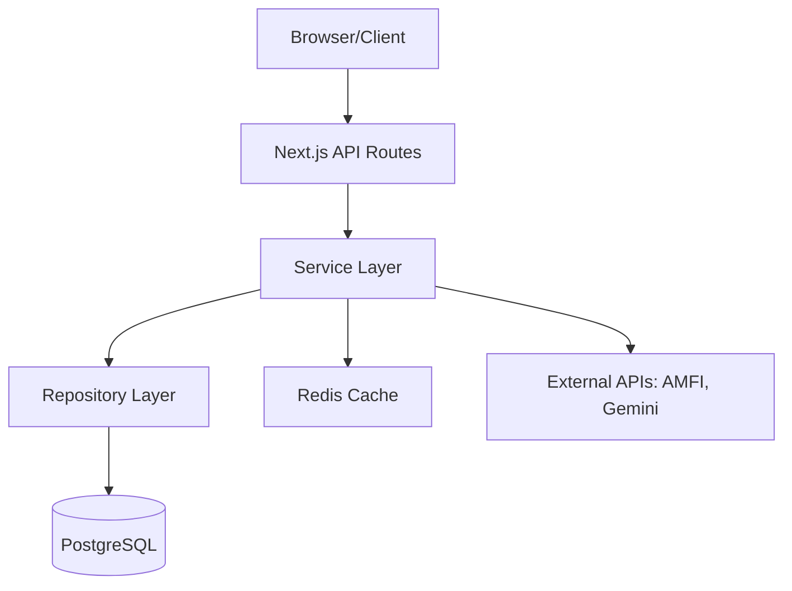
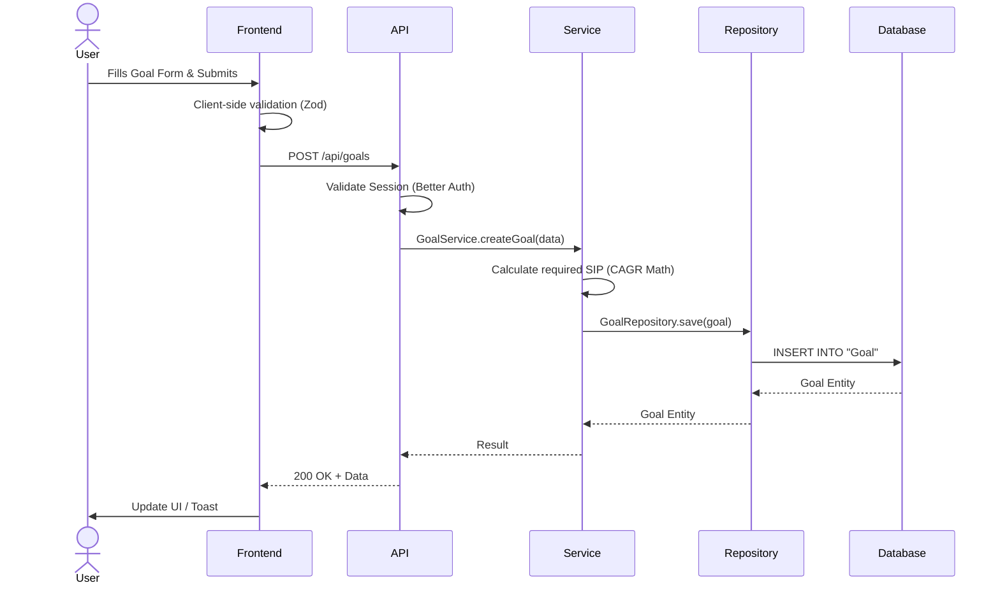
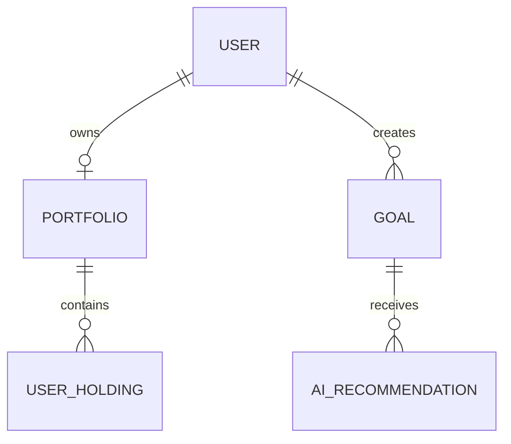

# FinCal Project Documentation

This document serves as the single source of truth for the FinCal project. It outlines the architecture, technology stack, features, and internal workings of the application.

---

## 1. Project Overview

**Purpose**: FinCal is an intelligent personal finance platform that helps users track their mutual fund portfolios, calculate SIPs, set financial goals, and receive AI-driven investment recommendations.
**Problem it solves**: Managing disparate investments and planning for future goals (e.g., retirement, house purchase) is complex. FinCal unifies portfolio tracking with goal-based planning and actionable AI insights.
**Target users**: Retail investors looking for a consolidated dashboard to track their wealth and receive unbiased, data-backed mutual fund recommendations.
**Current implementation status**: Fully functional MVP with authentication, portfolio tracking, real-time NAV fetching, goal planning, and an AI advisory layer.
**Future scalability**: Designed with a layered architecture (Service-Repository) and caching (Redis) to scale easily as the user base and data volume grow.

---

## 2. Tech Stack

### Core Frameworks & Languages
* **Next.js (v16.1.6)**: App Router architecture. Provides server-side rendering, API routes, and seamless frontend-backend integration.
* **React (v19.0.0)**: UI library for building interactive components.
* **TypeScript (v6.0.3)**: Adds static typing to JavaScript, enhancing code quality and DX.

### Database & ORM
* **PostgreSQL**: Primary relational database for structured data.
* **Prisma (v5.0.0)**: Type-safe ORM for database migrations and queries. Used in the Repository layer.
* **Redis (ioredis)**: In-memory data store used for caching external API responses (e.g., AMFI NAV data).

### Authentication & Security
* **Better Auth (v1.6.25)**: Modern, secure authentication library for handling user sessions, credentials, and OAuth.

### UI & Styling
* **Tailwind CSS**: Utility-first CSS framework for rapid UI development.
* **Lucide React**: Clean and modern iconography.
* **Radix UI**: Unstyled, accessible UI primitives (Accordion, Dialog, Slider, Tooltip).
* **Recharts**: Composable charting library used for financial visualizations (GlidePath, AreaChart, DonutChart).

### AI & Integrations
* **Google Generative AI (`@google/generative-ai`)**: Powers the AI Assistant and mutual fund recommendation engine.

### Utilities
* **Zod**: TypeScript-first schema validation for API inputs.
* **jsPDF & html2canvas**: For exporting financial reports and charts to PDF.

---

## 3. Folder Structure

```
src
 ├── app              # Next.js App Router (Pages & API Routes)
 │   ├── (dashboard)  # Protected dashboard routes
 │   ├── api          # Backend API endpoints
 │   └── login        # Public auth routes
 ├── backend          # Backend Domain Logic
 │   ├── infrastructure # DB & Cache Clients
 │   ├── repositories # DB access layer
 │   └── services     # Business logic layer
 ├── components       # React UI Components
 │   ├── charts       # Recharts wrappers
 │   ├── dashboard    # Dashboard specific UI
 │   ├── layout       # Shell & Navigation
 │   └── ui           # Shared primitives (Radix, custom)
 ├── hooks            # Custom React hooks (useApi, useDashboard)
 ├── lib              # Shared utilities (auth, logger, apiWrapper)
 └── validations      # Zod schemas for API input validation
prisma
 ├── schema.prisma    # Database schema
```

---

## 4. Complete Architecture

FinCal follows a **Layered Architecture** closely resembling Domain-Driven Design (DDD) principles:

1. **Presentation Layer (Frontend)**: React components in `src/app` and `src/components`.
2. **API Layer**: Next.js Route Handlers (`src/app/api`). Parses requests, validates input using Zod, and delegates to services.
3. **Service Layer (`src/backend/services`)**: Contains core business logic (e.g., `NavService`, `GoalService`). Orchestrates data fetching, AI calls, and calculations.
4. **Repository Layer (`src/backend/repositories`)**: Abstracts Prisma ORM calls. Ensures the Service layer doesn't write raw SQL or Prisma syntax.
5. **Infrastructure Layer (`src/backend/infrastructure`)**: Manages connections to external systems (Prisma Client, Redis Cache).



---

## 5. Data Flow

### Example: Creating a Goal



---

## 6. Authentication Flow

FinCal uses **Better Auth** for authentication.
* **Registration/Login**: Users authenticate via standard email/password or OAuth (if configured).
* **Sessions**: Better Auth manages sessions in the database (`Session` table).
* **Middleware**: `src/middleware.ts` intercepts requests to protected routes (`/(dashboard)/*`) and redirects unauthenticated users to `/login`.
* **API Protection**: API routes are wrapped with `withApiAuthAndError` (`src/lib/apiWrapper.ts`), which automatically verifies the session before executing the route handler.

---

## 7. Database

**Schema (Prisma)**
* **Auth**: `User`, `Session`, `Account`, `Verification`
* **Profile**: `InvestorProfile`, `UserPreferences`
* **Portfolio**: `Portfolio`, `UserHolding`, `PortfolioSnapshot`
* **Goals**: `Goal`, `GoalProgress`, `AIRecommendation`, `AIInsightHistory`

**Key Relationships**:
* A `User` has one `Portfolio` and one `InvestorProfile`.
* A `Portfolio` has many `UserHolding`s.
* A `User` can have multiple `Goal`s.
* A `Goal` has many `AIRecommendation`s.



---

## 8. API Documentation

* **POST `/api/onboarding`**: Saves investor risk profile and initial capital.
* **GET/PUT `/api/profile`**: Fetches/updates user preferences and profile data.
* **GET `/api/portfolio`**: Aggregates holdings, fetches live NAVs, and calculates current P&L.
* **POST `/api/goals`**: Creates a new financial goal and calculates the required SIP.
* **GET `/api/goals/[id]/recommend`**: Triggers the AI pipeline to recommend specific mutual funds for a goal.
* **POST `/api/sip/calculator`**: Stateless endpoint to calculate SIP returns based on input parameters.

---

## 9. Features

1. **Portfolio Tracking**: Users add mutual fund holdings. `PortfolioService` aggregates them and fetches live NAVs using `NavService` to calculate daily P&L.
2. **Goal Planning**: Users define targets (e.g., ₹1Cr in 10 years). The system calculates the monthly SIP required assuming a baseline CAGR based on their risk appetite.
3. **AI Recommendations**: Uses Gemini to analyze a user's risk profile, goal duration, and current market conditions to suggest specific mutual funds (Scheme Codes) and asset allocation percentages.
4. **SIP Calculator**: A playground to visualize compounding with interactive Recharts.

---

## 10. State Management

* **Server State**: Managed via custom hooks (`useApi`) fetching data from Next.js API routes.
* **Global/Local State**: React `useState` and `useContext` for UI toggles (sidebar, modals).
* **Caching**: The backend heavily utilizes Redis to cache AMFI NAV data to prevent rate-limiting and improve frontend load times.

---

## 11. Components

* **Layouts**: `DashboardShell.tsx` (Sidebar, Navbar, Mobile Menu).
* **UI Primitives**: Custom components in `src/components/ui/` built on top of Radix (e.g., `Accordion.tsx`, `GlowMenu.tsx`, `SkeletonLoader.tsx`).
* **Charts**: Recharts abstractions in `src/components/charts/` (e.g., `AllocationChart.tsx`, `GlidePath.tsx`).
* **Feature Components**: `HoldingModal.tsx` for adding funds, `GoalsPreview.tsx` for dashboard summaries.

---

## 12. Services

* `NavService`: Fetches latest and historical NAVs from mfapi.in. Has fallback logic to parse the raw AMFI text file if the API fails.
* `PortfolioService`: Aggregates holdings, calculates XIRR/CAGR, and orchestrates `NavService` calls.
* `GoalService`: CRUD for goals, calculates required investments based on time horizons.
* `AIService`: Interfaces with Google Gemini. Injects context (market data, user profile) into prompts and parses JSON responses.
* `FundAnalyticsService`: Analyzes individual funds (risk, category, historical performance).

---

## 13. Repository Layer

* `GoalRepository`: Handles Prisma queries for Goals and AI Recommendations.
* `PortfolioRepository`: Handles Prisma queries for Portfolios, Holdings, and Snapshots.
* `InvestorProfileRepository`: Handles upserting and retrieving user risk profiles.
**Pattern**: Repositories expose clean interfaces (e.g., `findById(id: string)`) keeping Prisma syntax out of the services.

---

## 14. Utility Functions

* `apiWrapper.ts`: `withApiAuthAndError` high-order function to standardise API error responses and enforce authentication.
* `logger.ts`: Standardized logging utility for backend observability.

---

## 15. Validation

Zod is used across the stack:
* **API Validation**: Route handlers parse `req.json()` using schemas from `src/validations/` (e.g., `goalSchema`, `portfolioSchema`).
* **Type Safety**: Zod infers TypeScript types used throughout the frontend.

---

## 16. AI Integration

* **Prompt Flow**: When a user requests recommendations, `AIService` pulls their `InvestorProfile`, the `Goal` details, and recent market data. It constructs a highly specific prompt instructing Gemini to act as a SEBI-registered advisor.
* **Output**: Gemini is forced to output structured JSON matching a predefined schema.
* **Storage**: Responses are saved in the `AIRecommendation` database table.

---

## 17. Security

* **Auth**: Better Auth handles secure cookies and session tokens.
* **Database**: Prisma inherently protects against SQL Injection.
* **Environment**: API keys (Gemini, Database) are strictly server-side.
* **Validation**: Zod prevents malicious payloads from reaching the database.

---

## 18. Environment Variables

* `DATABASE_URL`: PostgreSQL connection string (Required).
* `BETTER_AUTH_SECRET`: Secret for signing session cookies (Required).
* `GEMINI_API_KEY`: Google AI API key (Required for AI features).
* `REDIS_URL`: Connection string for caching (Required).

---

## 19. Build Pipeline & Deployment

* **Compilation**: Handled by Next.js (Turbopack in dev, standard Webpack in prod).
* **Docker**: Includes a `Dockerfile` and `docker-compose.yml` for containerized deployment of the Node app, Postgres, and Redis.
* **CI/CD**: `.github/workflows/ci.yml` runs linters (`npm run lint`) and tests on pull requests.

---

## 20. Error Handling

* **Backend**: `withApiAuthAndError` catches thrown errors, logs them using `logger.ts`, and returns standard `{ error: message }` JSON.
* **External APIs**: `NavService` never throws on external failure. It gracefully returns a `navUnavailable` flag, which the frontend handles by showing a warning state instead of breaking the UI.
* **Frontend**: Components check for `error` properties from API responses and render `ErrorMessage` components.

---

## 21. Limitations & Future Improvements

**Current Limitations**:
* Heavy reliance on `mfapi.in` for live NAVs. If it goes down, the AMFI text parser fallback works, but is slower.
* XIRR calculation is resource-intensive for large portfolios.

**Suggested Improvements**:
1. **High**: Implement background Cron jobs to fetch and cache AMFI NAVs proactively at midnight, removing the need for user requests to trigger the expensive fetch.
2. **Medium**: Migrate React state to a robust client cache like React Query (@tanstack/react-query) to reduce redundant API calls and improve optimistic UI updates.
3. **Low**: Add WebSockets for real-time portfolio updates during market hours.

---

## 22. Request Lifecycle (Example)

1. **Browser**: User clicks "Save Goal".
2. **React**: `useApi` hook fires POST request.
3. **Next.js API**: Route matched, `withApiAuthAndError` runs.
4. **Auth**: Session validated via Better Auth.
5. **Validation**: Zod parses request body.
6. **Service**: `GoalService.createGoal` invoked.
7. **Repository**: `GoalRepository` executes Prisma query.
8. **Database**: PostgreSQL transaction commits.
9. **Response**: JSON sent back to client.
10. **UI Update**: Dashboard refreshes to show new goal.

---

## 23. Overall Summary

FinCal is a highly structured, scalable personal finance application. Its use of the Service-Repository pattern ensures that business logic remains decoupled from the database ORM and HTTP layer, allowing for easy testing and refactoring. The integration of Redis ensures that external data bottlenecks are mitigated, and the use of Zod/TypeScript guarantees end-to-end type safety. The project is production-ready and built on modern architectural standards.
